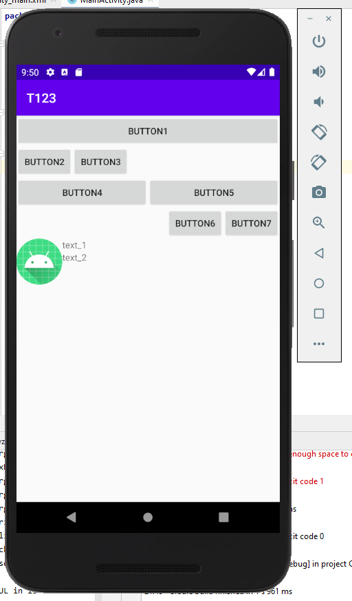
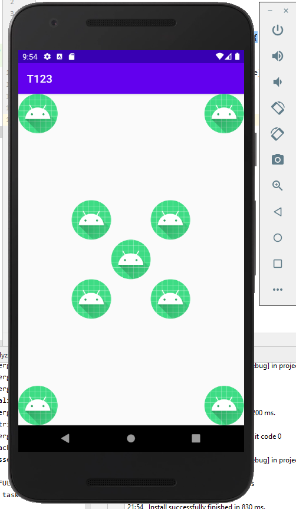

# Linear
LinearLayout adalah susunan tata letak yang paling simple dapat digunakan para developer android. Karena layout ini hanya memberikan susunan tata letak komponen secara garis lurus.LinearLayout bisa dibagi menjadi 2 yaitu secara horizontal dan vertikal

 
 
 
 # relative
 Untuk RelativeLayout kita bisa mengaturnya mengikuti komponen lainnya, semisal ada komponen A, B, dan C maka kita bisa mengaturnya seperti , A berada dibawah B, dan C berada     di samping kanan/kiri A dan sebagainya. Intinya adalah komponen satu dan lainnya saling berkaitan.
 
 
 
 # constrain
 ConstraintLayout merupakan salah satu komponen ViewGroup yang dapat kita gunakan untuk menyusun tampilan aplikasi yang kompleks tanpa adanya nested layout. ConstraintLayout tersedia dengan dukungan kompatibilitas mulai dari Android 2.3 (API Level 9) sampai dengan yang terbaru.

ConstraintLayout memiliki kesamaan dengan RelativeLayout. Dalam penggunaan semua view yang berada di dalamnya disusun berhubungan antara parent dan view lainnya. Tapi ConstraintLayout lebih fleksibel dari RelativeLayout dan mudah digunakan dengan dukungan Layout Editor pada Android Studio.
